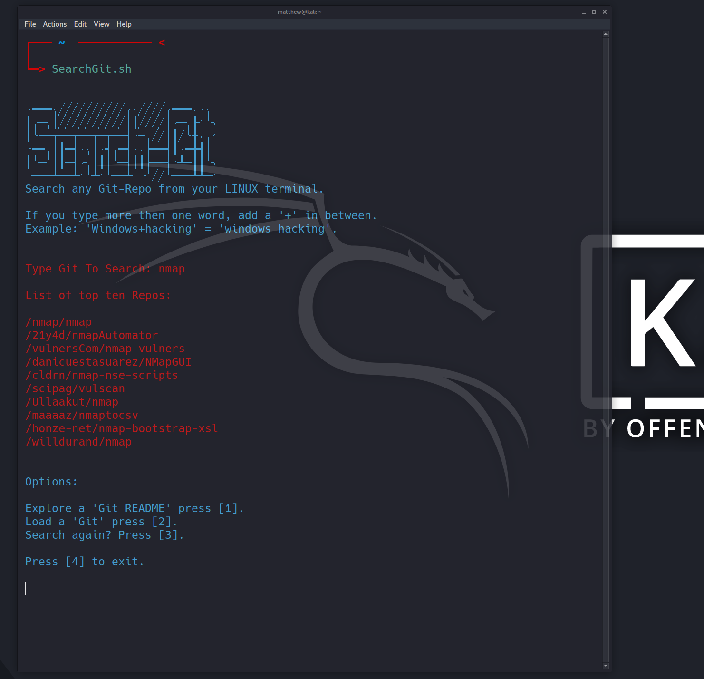
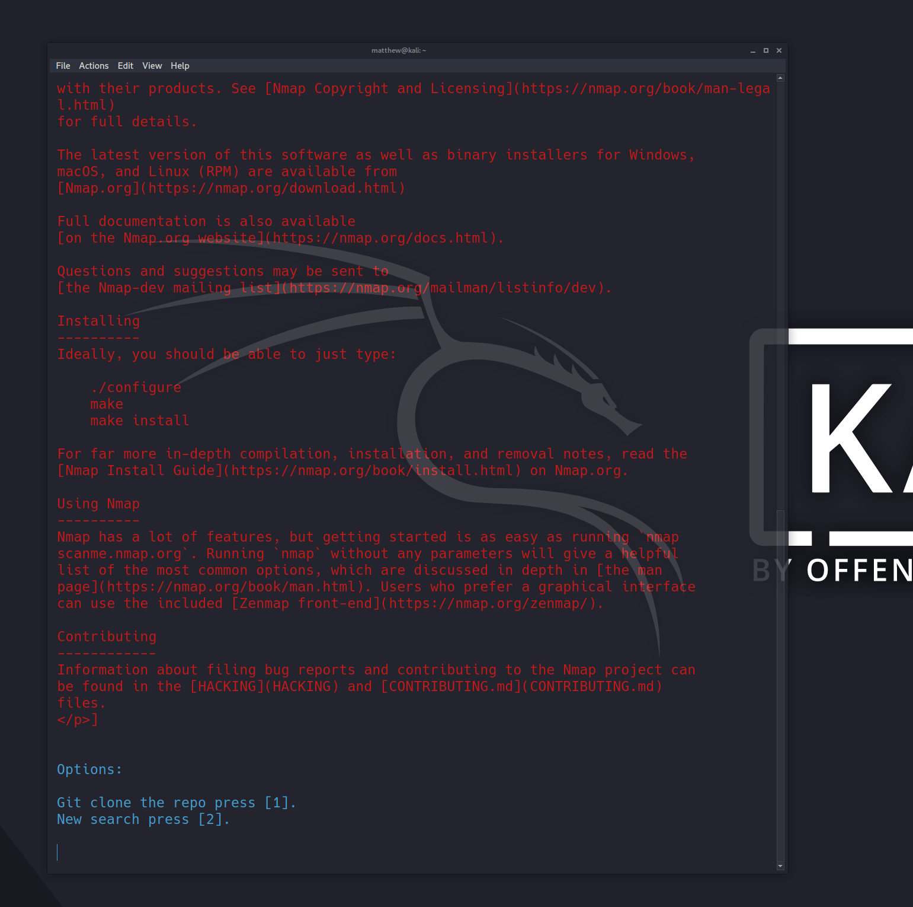

# SearchGit
SearchGit allows you to search any Git-repo, view the README info, and install any program exclusively from your own Linux terminal.

## Instructions
First type `./SearchGit.sh` Then type in the desired repo you wish to search (if the search requires more then one word, use a `+` in between each word for the needed search. Example: Linux+exploits will = Linux exploits).

SearchGit will then give you the top ten results of your search. If you would like to view more information on a repo: Copy the handle of a given repo, press the number `1` and then past the repo in the prompt that says "Add repo here:".

SearchGit will then pull the infomation of the README.md file into the terminal. Note: if the repo only has a README file and not a README.md file, the program will only send back a 404 error. You will then need to use a webpage to view that repo.

At the bottom of your terminal you will be prompted to make a final choice. Press `1` and the repo will be cloned to the SearchGit file location. If you press `2` you will be taken back to the first prompt: Where you can search another repo.

## Dependencies
Run the `Dependencies.sh` file. You will need Python3 if you don't yet have it.
